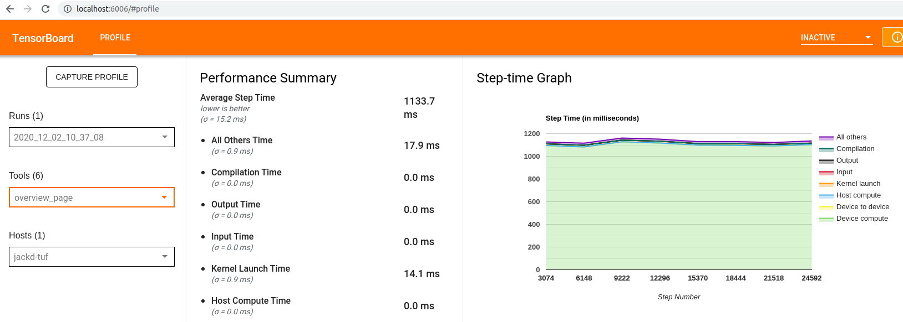
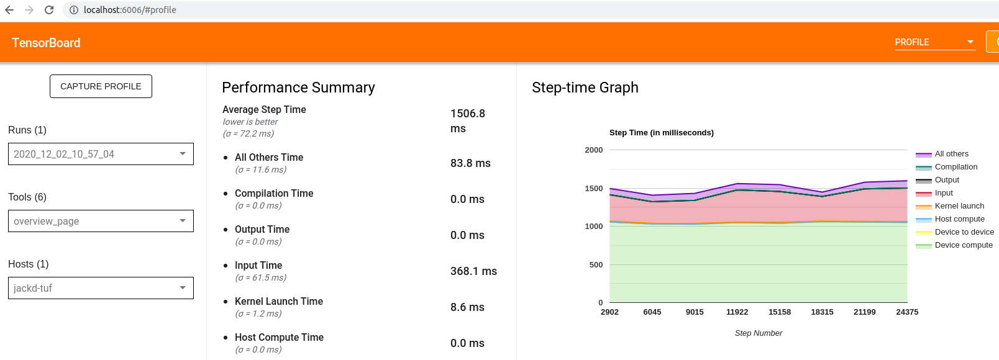

# [Point Cloud Convolutions](https://github.com/jackd/pcn)

[tensorflow](https://tensorflow.org) implementation of point-cloud models from _Sparse Convolutions on Continuous Domains for
Point Cloud and Event Stream Networks_, ACCV2020.

- [ACCV 2020 Paper](paper)
- [sccd repository](https://github.com/jackd/sccd)
- [Spotlight Video](https://youtu.be/OihcDbfT1ks) (1min)
- [Oral Presentation](https://youtu.be/26GDhWfU280) (9min)

```tex
@InProceedings{Jack_2020_ACCV,
    author    = {Jack, Dominic and Maire, Frederic and Denman, Simon and Eriksson, Anders},
    title     = {Sparse Convolutions on Continuous Domains for Point Cloud and Event Stream Networks},
    booktitle = {Proceedings of the Asian Conference on Computer Vision (ACCV)},
    month     = {November},
    year      = {2020}
}
```

## Quick Start

### Installation

```bash
# pip dependencies
# not included in requirements.txt because tf-nightly might be installed
pip install tensorflow  # requires at least 2.3

# pip packages from git
git clone https://github.com/jackd/pcn.git
cd pcn
pip install -r requirements.txt
pip install -e .
```

### Train

Train the large resnet model from the paper:

```bash
python -m pcn '$KB_CONFIG/trainables/fit.gin' '$PCN_CONFIG/trainables/large.gin'
tensorboard --logdir=~/pcn/pn2/large/default_variant/run-00
```

See also [examples/pn2-large.py](examples/pn2-large.py) for a complete training example without `kblocks` CLI and only minimal [gin](gin-config) configuration.

Note the first time this is run, 32 epochs of augmented data are preprocessed and cached. This may take some time.

### `python -m pcn`

`python -m pcn` is a light wrapper around `python -m kblocks` which exposes `$PCN_CONFIG` for command line argument just like `$KB_CONFIG` is exposed in `kblocks`. In particular, note that `$PCN_CONFIG` is set inside the python script, so must be passed as a string, e.g. `python -m pcn '$PCN_CONFIG/foo'` rather than `python -m pcn $PCN_CONFIG/foo`. See [kblocks](kblocks) for more examples.

## Custom Package Dependencies

This project depends on multiple custom python packages. These are:

- [kblocks](kblocks) for experiment management, configuration via [gin-config](gin-config) and various tensorflow utilities.
- [meta-model](https://github.com/jackd/meta-model) for simultaneously building and connecting the multiple models associated with data pipelining and model training.
- [tfrng](https://github.com/jackd/tfrng) for random number generation and deterministic, pre-emptible data pipelining.
- [wtftf](https://github.com/jackd/wtftf) for keras layer wrappers for composite tensors in tensorflow 2.3.
- [shape-tfds](https://github.com/jackd/shape-tfds) for [tensorflow-datasets](https://github.com/tensorflow/datasets) implementations that manage dataset downloading and model-independent preprocessing for 3D shape-based datasets.
- [numba-neighbors](https://github.com/jackd/numba-neighbors) for [numba](https://github.com/numba/numba) implementations of KDTree ball searches and subsampling.

## Saved Data

Running with the default configurations will result in data files created in:

- `~/tensorflow_datasets/`: downloads, extracted files and basic preprocessing of events into `tfrecords` files.
- `~/pcn/`: configuration logs, model checkpoints, training summaries and cached datasets (potentially hundreds of GBs - see below).

### Example configurations

Fit a large model with online data preprocessing, with run id 1.

```bash
python -m pcn '$KB_CONFIG/trainables/fit.gin' \
    '$PCN_CONFIG/trainables/large.gin' \
    '$PCN_CONFIG/data/aug/online.gin' \
    --bindings='run=1'
```

Visualize data augmentation (requires trimesh: `pip install trimesh`)

```bash
python -m pcn '$PCN_CONFIG/vis.gin' '$PCN_CONFIG/data/pn2.gin'
```

## Benchmarks

### Convolution Operation Benchmarks

Our operation benchmarks (Table 2) are generated using tensorflow's CSR matmul implementation (requires tensorflow 2.3), though the standard `tf.sparse.sparse_dense_matmul` implementation is almost as fast. The following generates the `N(F \Theta)-JIT` row from the paper.

```bash
python pcn/ops/conv_benchmark.py --sparse_impl=csr --transform_first --jit
```

Results on a GTX-1080Ti:

```txt
-----
forward
Wall time (ms): 2.6831626892089844
Memory (Mb):    40.0
backward
Wall time (ms): 4.087090492248535
Memory (Mb):    49.00001525878906
```

### Network Benchmarks

Values in Table 3 were generated with tensorflow's profiler and can be visualized on tensorbaord.

#### Setup

You may need to install / upgrade the tensorboard plugin for best results:

```bash
pip install tensorboard_plugin_profile  # optional - for extra features
```

This will also require `libcupti` on your `$LD_LIBRARY_PATH`. Ensure a version consistent with your tensorflow installation can be found with

```bash
/sbin/ldconfig -N -v $(sed 's/:/ /g' <<< $LD_LIBRARY_PATH) | grep libcupti
```

#### Generating Profiles

Training models with default configuration will result in a profile being stored in tensorboard logs, though note if using a lazy cache implementation (see below) this may include CPU preprocessing if the cached files are being created lazily (i.e. you have not trained a similar model previously). The following generates files for a single epoch offline then profiles performance using those caches.

```bash
# generate lazy caches eagerly - not necessary is using an eager implementation
python -m pcn \
  '$KB_CONFIG/trainables/iterate-over-data.gin' \
  '$PCN_CONFIG/trainables/large.gin' \
  --bindings='cache_repeats=1'  # don't bother generating all 32 epochs
# generate profile
python -m pcn \
  '$KB_CONFIG/trainables/profile.gin' \
  '$PCN_CONFIG/trainables/large.gin' \
  --bindings='
    cache_repeats=1
    path="/tmp/pcn_profile_offline"  # creates a dir in /tmp if not provided
    batch_size=1024
  '
# visualize
tensorboard --logdir=/tmp/pcn_profile_offline
# navigate to {tensorboard_url}#profile, e.g. http://localhost:6006/#profile
```



Values in Table 3 of the [paper](paper) are computed as `batch_time * examples_per_epoch / batch_size`. In the above example, that would be `1133.7ms * 9840 / 1024 = 10.9s`. Note this was captured on a laptop with a 1050-Ti GPU, not a 1080-Ti as was used for results in the paper.

To generate values with online preprocessing, use

```bash
python -m pcn \
  '$KB_CONFIG/trainables/profile.gin' \
  '$PCN_CONFIG/trainables/large.gin' \
  '$PCN_CONFIG/data/aug/online.gin' \
  --bindings='
    path="/tmp/pcn_profile_online"
    batch_size=1024
  '
```



## Caching

Caching (particularly with the default `tfrecords_cache` implementation) may take a while. There are a few ways of speeding this up.

Firstly, there are other caching implementations available in [kblocks/data/cache](https://github.com/jackd/kblocks/blob/master/kblocks/data/cache.py). Default configuration is defined in [data/aug/offline.gin](pcn/configs/data/aug/offline.gin). Currently we use `tfrecords_cache` which is a custom implementation. This may take longer than other options, but _seems_ to resolve a memory leak observed in other implementations. Cache implementations in `kblocks.data` include:

| `kblocks.data` method       | Based on                                 | Lazy/Eager | Supports Compression | Possible memory leak |
|---------------------------- |------------------------------------------|------------|----------------------|----------------------|
| `snapshot`                  | `tf.data.experimental.snapshot`          | Lazy       | [x]                  | [x]                  |
| `cache`                     | `tf.data.Dataset.cache`                  | Lazy       | []                   | []                   |
| `save_load_cache`           | `tf.data.experimental.[save,load]`       | Eager      | [x]                  | [x]                  |
| `tfrecords_cache` (default) | `kblocks.data.tfrecords.tfrecords_cache` | Eager      | [x]                  | []                   |

Other options to reduce initial caching time include:

- reducing the number of `cache_repeats` (e.g. `cache_repeats = 16`)
- using online augmentation (e.g. `include "$PCN_CONFIG/data/aug/online.gin"`)

## Reproducibility

Effort has been made to make training fully deterministic (i.e. produce identical floating point vlaues). Two outstanding issues remain:

- _non-deterministic ops_: nvidia's [determinism repository](https://github.com/NVIDIA/framework-determinism) lists certain operations as non-deterministic. These include the sparse-dense matrix multiplications included in the cloud convolution operations. This will hopefully be address in tensorflow soon.
- _uncheckpointable cached datasets_: training uses the default `track_iterator=False` in `kblocks.models.fit`, meaning training over separate calls (e.g. because of pre-emption) will not save or restore training dataset iterator state. This may work with some `cache` implementations. This should not affect results for models trained in a single session.

[paper]: https://openaccess.thecvf.com/content/ACCV2020/html/Jack_Sparse_Convolutions_on_Continuous_Domains_for_Point_Cloud_and_Event_ACCV_2020_paper.html
[kblocks]: https://github.com/jackd/kblocks
[gin-config]: https://github.com/google/gin-config
